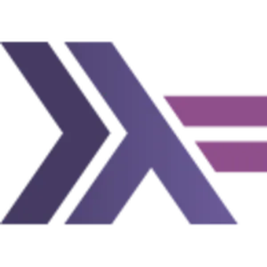

# GLaDOS - Epitech Project  
  
The repository for the GLaDOS project.  
  
<div id="Illustration_Haskell" style="display: flex;">  
    
    
    
</div>  
  
---  
  

## Table of contents  
  
[1. The purpose of the project](#titre1)<br />
[A) The subjects of the project 📄](#titre11)<br />
[B) Rules for conventional commit messages 📄](#titre12)<br />

[2. How to use GLaDOS](#titre2)<br />

[3. People on the project](#titre3)<br />
  
---  
  

## <a id="titre1"></a>1. The purpose of the project  
  
The purpose of the project is to implement a programming language that we have created, in [Haskell](https://www.haskell.org/).    
We have to implement a compiler for this language, and a virtual machine to run the compiled code.  
  
### <a id="titre11"></a>A) The subjects of the project 📄

1 [Bootstrap - Abstract Syntax Tree and Evaluation](https://intra.epitech.eu/module/2023/B-FUN-500/PAR-5-1/acti-610932/project/file/B-FUN-500_GLaDOS_bootstrap.pdf)
  
2 [Bootstrap - My parsing library from the ground up](https://intra.epitech.eu/module/2023/B-FUN-500/PAR-5-1/acti-610935/project/file/B-FUN-500_GLaDOS_bootstrap2.pdf)  

3 [Bootstrap - It’s tortoises all the way down...](https://intra.epitech.eu/module/2023/B-FUN-500/PAR-5-1/acti-610938/project/file/B-FUN-500_GLaDOS_bootstrap3.pdf)  

4 [GLaDOS - Generic Language and Data Operand Syntax](https://intra.epitech.eu/module/2023/B-FUN-500/PAR-5-1/acti-610933/project/file/B-FUN-500_GLaDOS.pdf)  

### <a id="titre11"></a>B) Rules for conventional commit messages 📄

[The document rules for conventional commit messages](docs/COMMITS.md)

---  
  

## <a id="titre2"></a>2. How to use GLaDOS  
  
To compile and **launch the project**, you need to have the [Haskell Stack installed](https://docs.haskellstack.org/en/stable/install_and_upgrade/) on your computer.  
And then, run the following commands:  
  
```bash  
make  
./glados < [file]  
```  
  
To check that the program is running correctly, you can use this command to **run tests**:  
  
```bash  
make test_run  
```  
  
  
---  
  

## <a id="titre3"></a>3. Contributors  
  
| [<br><sub>Cyprien Nguyen-Van-Vien</sub>](https://github.com/Drindael) | [<br><sub>Damien Benais-Captal</sub>](https://github.com/damienBC) | [<br><sub>Pierre-Louis Leroy</sub>](https://github.com/Pierrelouisleroy) | [<br><sub>Viktor Bruggeman</sub>](https://github.com/Hinivir) | [<br><sub>Virgile Berrier</sub>](https://github.com/Lipatant)  
| :--: | :--: | :--: | :--: | :--: |  

  
  
cyprien.nguyen-van-vien@epitech.eu  
damien.benais-captal@epitech.eu  
pierre-louis.leroy@epitech.eu  
viktor.bruggeman@epitech.eu  
virgile.berrier@epitech.eu  
  